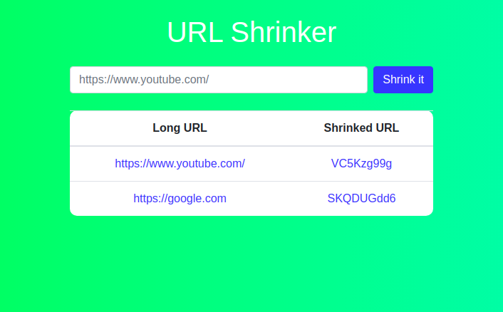

# URL Shrinker

It is a microservice which can be used to shrink long string of urls into small urls.

### Dependencies:

 1. Express  
 2. Mongodb 
 3. Mongoose  
 4. Dotenv 
 5. Cors
 6. shortid
 7. nodemon
 
### Installation and Running
 1. Download or clone the project 
 2. Run "npm install" and then "npm start"
 
### How to use it?

 Post any valid url (http(s)://website-name.com/..) in the input box and it will give you a tiny shrinked url.
 
### Screenshots

